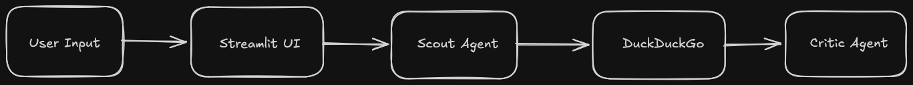

# 🚀 VentureVal: Autonomous AI Business Validator


**[🟢 Try the Live Web App Here!](https://ventureval-keshavag.streamlit.app/)**

**VentureVal** is an Enterprise-grade Multi-Agent System designed to automate market research and business validation. It employs a swarm of specialized AI agents to scout the live web, analyze competitors, and generate strategic SWOT analyses in seconds.

## 🧠 How it Works (Multi-Agent Architecture)



The system is built using the **Google Agent Development Kit (ADK)** and operates in a sequential pipeline:
1. **User Input:** The user provides a business idea via the Streamlit UI.
2. **The Scout (Researcher):** Bypasses standard LLM knowledge cutoffs by using a custom DuckDuckGo `FunctionTool` to fetch real-time market data, competitors, and trends.
3. **The Critic (Evaluator):** Acts as a Venture Capitalist. It ingests the Scout's raw data and evaluates the business idea, generating a structured SWOT analysis and a final "Venture Score."

## ⚙️ Tech Stack
* **Language:** Python
* **Package Manager:** `uv` (Blazing fast dependency resolution)
* **AI Framework:** Google ADK
* **LLM:** Google Gemini 2.5 Flash / 1.5 Flash (Auto-detecting)
* **Frontend:** Streamlit

## 🛠 Local Setup & Installation

We use [uv](https://github.com/astral-sh/uv) for fast, reliable Python environment management.

```bash
# 1. Clone the repository
git clone https://github.com/keshavagarwal321/VentureVal.git
cd VentureVal

# 2. Install dependencies via uv
uv add google-adk duckduckgo-search python-dotenv streamlit

# 3. Setup Environment Variables
# Create a .env file in the root directory and add your API key:
echo "GOOGLE_API_KEY=your_actual_api_key_here" > .env
```

## 🚀 Usage

To run the Streamlit Web Interface locally:
```bash
uv run streamlit run app.py
```

## 🗺️ Roadmap (Coming Soon)
- [ ] **PDF Export:** Download SWOT analysis as a professional executive report.
- [ ] **Data Visualization:** Radar charts for "Venture Score" metrics using Plotly.
- [ ] **Session History:** SQLite integration to save past validations.

## 🤝 Contributing
Open source contributions are welcome! Please open an issue to discuss proposed changes.